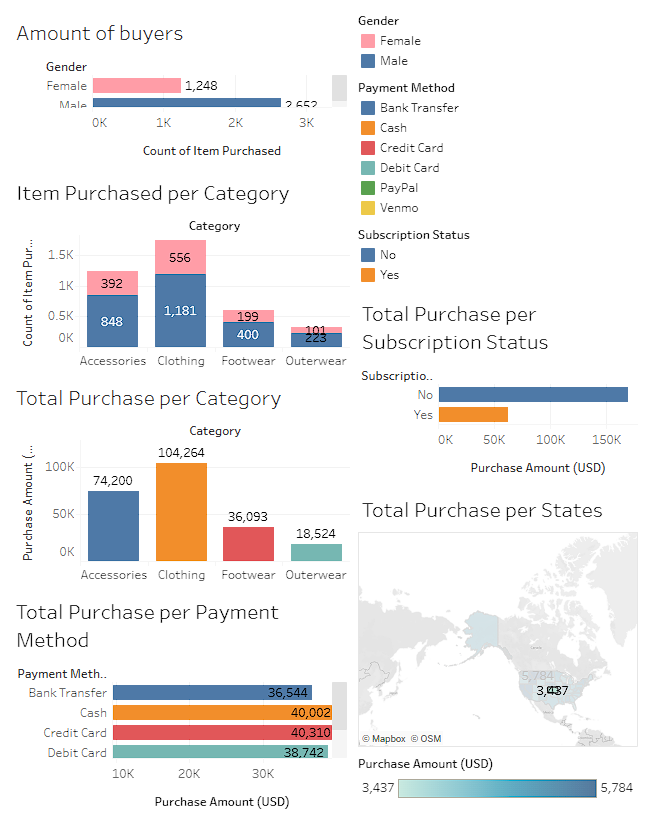

# 🛒 Customer Shopping Trends - Data Analytics Project

This repository contains the **Final Project for Data Analytics**, focusing on customer shopping behavior analysis.  
The dataset is sourced from Kaggle: [Customer Shopping Trends Dataset](https://www.kaggle.com/datasets/iamsouravbanerjee/customer-shopping-trends-dataset).

---

## 👥 Group Members
- Robert Jefferson Sugianto (2702242915)  
- Ignatius Abraham Aristio Kusnadi (2702243590)  
- Leon (2702251604)  
- Zephania Widjaja (2702254695)  
- Jazlyn Phylicia (2702247916)  
- Hernando Tan (2702240954)  

**Class:** LD01  
**Academic Year:** 2024/2025  

---

## 📌 Objectives
- Perform **data preprocessing and cleaning** on raw shopping trends dataset.  
- Analyze **customer behavior patterns** such as gender, age group, purchase category, payment methods, and frequency.  
- Apply **visualizations** to identify key insights and trends.  
- Provide insights useful for **business decision making**.  

---

## 🗂 Dataset
- **Source:** [Kaggle - Customer Shopping Trends Dataset](https://www.kaggle.com/datasets/iamsouravbanerjee/customer-shopping-trends-dataset)  
- **Size:** ~3900 rows, 18 columns  
- **Attributes include:**  
  - `Customer ID`, `Age`, `Gender`, `Item Purchased`, `Category`  
  - `Purchase Amount (USD)`, `Location`, `Size`, `Color`  
  - `Season`, `Review Rating`, `Subscription Status`  
  - `Discount Applied`, `Promo Code Used`, `Previous Purchases`  
  - `Payment Method`, `Shipping Type`  

---

## 🛠 Tools & Libraries
- **Environment:** Jupyter Notebook / Google Colab  
- **Libraries:**  
  - `pandas` → data cleaning & manipulation  
  - `numpy` → numerical analysis  
  - `matplotlib`, `seaborn` → visualizations  
  - `scikit-learn` (optional) → clustering / ML  

---

## 🔎 Methodology

### 1. Data Preprocessing
- Handle **missing values** and duplicates.  
- Standardize categorical variables.  
- Convert numeric fields where necessary.  

### 2. Exploratory Data Analysis (EDA)
- Demographic distribution (gender, age).  
- Most popular product categories.  
- Payment method usage.  
- Review ratings and subscriptions.  

### 3. Visualization
- Created interactive dashboard using **Tableau**.  
- Dashboard link: 👉 [Customer Shopping Trends Dashboard](https://public.tableau.com/views/DashboardTrial_17475634635350/Dashboard1?:language=en-US&:sid=&:redirect=auth&:display_count=n&:origin=viz_share_link)  

📷 **Screenshots:**  
- Overall Dashboard  
    

---

## 📊 Results
- Female customers slightly outnumber male customers.  
- Clothing and accessories are the most purchased categories.  
- **Credit Card** is the most common payment method.  
- Customers with subscriptions show **higher purchase frequency**.  

---

## 💻 Link to Code
- [Google Colab Notebook](https://colab.research.google.com/drive/1FrKkMG75N4tPFHmphiV62ssLetOnyVSg?usp=sharing)  

---

## 🙏 Acknowledgment
- Dataset by [Sourav Banerjee on Kaggle](https://www.kaggle.com/datasets/iamsouravbanerjee/customer-shopping-trends-dataset).  
- Visualization dashboard created with [Tableau Public](https://public.tableau.com/).  
- Developed as part of **Data Analytics Final Project** coursework.  
